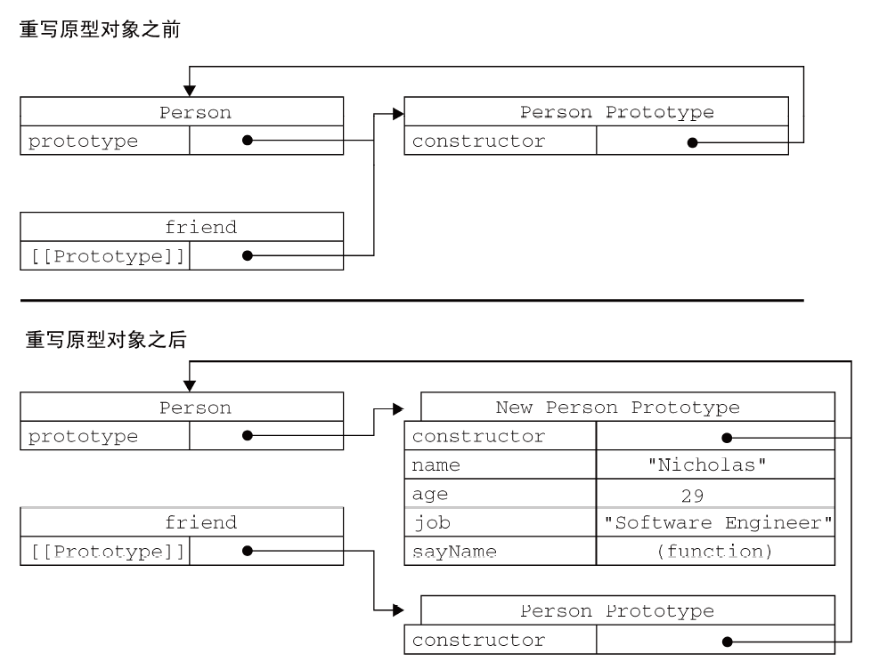

> 无序属性的集合，其属性可以包含基本值、对象或者函数

对象的每个属性或方法都有一个名字，名字映射到一个值——**ECMAScript对象-散列表**（名值对，值可以是数据或者函数）

每个对象都是基于一个引用类型创建的（原生类型或自定义类型）

##### 理解对象

1. 属性类型

   定义**内部采用的特性（attribute**）——**描述属性（property）的各种特性**

   - JS不能直接访问
   - 用`[[]]`表示内部特性内部值

   ECMAScript中有两种属性：

   1. 数据属性

      - `[[Configurable]]`:能否delete删除属性重新定义属性（默认为true）
      - `[[Enumerable]]`:能否通过for-in循环返回属性（默认为true）
      - `[[Writable]]`:能否修改属性的值（默认为true）
      - `[[Value]]`:包含属性的数据值（读和写，默认是undefined）

      修改属性默认的特性——`Object.defineProperty()`

      - 在调用`Object.defineProperty()`方法时，如果不指定，configurable、enumerable 和writable 特性的默认值都是false

   2. 访问器属性

      - `[[Configurable]]`:能否delete删除属性重新定义属性（默认为true）
      - `[[Enumerable]]`:能否通过for-in循环返回属性（默认为true）
      - `[[Get]]`:在读取属性时调用的函数
      - `[[Set]]`:在写入属性时调用的函数

      访问器属性不能直接定义，必须使用`Object.defineProperty()`来定义

      ```javascript
      var book = {
          _year: 2004,//下划线记号表示只能通过对象的方法访问的属性
          edition: 1
      };
      Object.defineProperty(book, "year", {
              get: function(){
              	return this._year;
              },
              set: function(newValue){
                  if (newValue > 2004) {
                  this._year = newValue;
                  this.edition += newValue - 2004;
              }
          }
      });
      book.year = 2005;
      alert(book.edition); //2
      ```

      定义多个属性——`Object.definProperties()`

      - 接收两个对象参数
        - 第一个对象是要添加和修改其属性的对象，
        - 第二个对象的属性与第一个对象中要添加或修改的属性一一对应

      ```javascript
      var book = {};
      Object.defineProperties(book, {
          _year: {//定义了数据属性
              value: 2004
          },
          edition: {//定义了数据属性
              value: 1
          },
          year: {//定义了访问属性
              get: function(){
                  return this._year;
              },
              set: function(newValue){
                  if (newValue > 2004) {
                      this._year = newValue;
                      this.edition += newValue - 2004;
              	}
          	}
      	}
      });
      ```

      读取属性的特性——`Object.getOwnPropertyDescripty()`(取得给定属性的描述符)

      - 接收两个参数
        - 属性所在对象
        - 读取其描述符属性的名称
      - 返回一个对象

      ```javascript
      var book = {};
      Object.defineProperties(book, {
          _year: {
          	value: 2004
          },
          edition: {
          	value: 1
          },
          year: {
              get: function(){
              	return this._year;
              },
              set: function(newValue){
                  if (newValue > 2004) {
                  this._year = newValue;
                  this.edition += newValue - 2004;
              	}
          	}
      	}
      });
      var descriptor = Object.getOwnPropertyDescriptor(book, "_year");
      alert(descriptor.value); //2004
      alert(descriptor.configurable); //false
      alert(typeof descriptor.get); //"undefined"
      var descriptor = Object.getOwnPropertyDescriptor(book, "year");
      alert(descriptor.value); //undefined
      alert(descriptor.enumerable); //false
      alert(typeof descriptor.get); //"function"
      ```

##### 创建对象

一. **Object 构造函数**或**对象字面量**都可以用来创建单个对象，

- 明显的缺点：使用**同一个接口**创建很多对象，会产生大量的重复代码
- 改进：使用工厂模式的变体

二. 工厂模式：用函数来封装以特定接口创建对象的细节

```javascript
function createPerson(name, age, job){
    var o = new Object();
    o.name = name;
    o.age = age;
    o.job = job;
    
    o.sayName = function(){
    	alert(this.name);
    };
    
	return o;
}
var person1 = createPerson("Nicholas", 29, "Software Engineer");
var person2 = createPerson("Greg", 27, "Doctor");
```

工厂模式虽然**解决了**

- **创建多个相似对象**的问题，
- 但却没有解决**对象识别**的问题（即怎样知道一个对象的类型）
- 改进：自定义工造函数

三. 构造函数模式：

```javascript
function Person(name, age, job){
    this.name = name;
    this.age = age;
    this.job = job;
    
    this.sayName = function(){
    	alert(this.name);
    };
}

var person1 = new Person("Nicholas", 29, "Software Engineer");
var person2 = new Person("Greg", 27, "Doctor");
```

和工厂模式的**区别**：

- 没有显式地创建对象；
-  直接将属性和方法赋给了this 对象；
- 没有return 语句
- 函数名Person 使用的是大写字母（区别于ECMAScript 中的其他函数）
- 必须使用new 操作符

**new 操作符**调用构造函数实际上会经历以下4个步骤：

- 创建一个新对象；
- 将构造函数的作用域赋给新对象（因此this 就指向了这个新对象）；
- 执行构造函数中的代码（为这个新对象添加属性）；
- 返回新对象

创建自定义的构造函数意味着将来可以

- 将它的**实例标识为一种特定的类型**；
- 而这正是构造函数模式胜过工厂模式的地方

**构造函数也是函数**：

- 构造函数与其他函数的唯一区别——**调用方式不同**

  - 任何函数，只要通过new 操作符来调用，就可以作为构造函数
  - 任何函数，如果不通过new 操作符来调用，跟普通函数一样

  ```javascript
  // 当作构造函数使用
  var person = new Person("Nicholas", 29, "Software Engineer");
  person.sayName(); //"Nicholas"
  // 作为普通函数调用
  Person("Greg", 27, "Doctor"); // 添加到window
  window.sayName(); //"Greg"
  // 在另一个对象的作用域中调用
  var o = new Object();
  Person.call(o, "Kristen", 25, "Nurse");
  o.sayName(); //"Kristen"
  ```

**构造函数的缺点**：

每个方法都要在每个实例上重新创建一遍

相当于：

```javascript
function Person(name, age, job){
    this.name = name;
    this.age = age;
    this.job = job;
    
    this.sayName = function(){
    	alert(this.name);
    };
}
//等价于
function Person(name, age, job){
    this.name = name;
    this.age = age;
    this.job = job;
    
	this.sayName = new Function("alert(this.name)"); // 与声明函数在逻辑上是等价的
}
```

- 每个Person 实例都包含一个**不同的Function 实例**

- 以这种方式创建函数，会导致不同的作用域链和标识符解析，

  - 但创建Function 新实例的机制仍然是相同的

- 因此，**不同实例上的同名函数是不相等的**

  ```javascript
  alert(person1.sayName == person2.sayName); //false
  ```

解决方案一：通过把函数定义转移到构造函数外部

```javascript
function Person(name, age, job){
    this.name = name;
    this.age = age;
    this.job = job;
	this.sayName = sayName;
}

function sayName(){
	alert(this.name);
}

var person1 = new Person("Nicholas", 29, "Software Engineer");
var person2 = new Person("Greg", 27, "Doctor");
//sayName 包含的是一个指向函数的指针，因此person1 和person2 对象就共享了在全局作用域中定义的同一个sayName()函数
```

缺点：

- 在全局作用域中定义的函数实际上只能被某个对象调用，这让全局作用域有点名不副实
- 如果对象需要定义很多方法，那么就要定义很多个全局函数，**没有封装性**了

解决方案二：使用**原型模式**来解决

四. 原型模式：

每个函数都有一个`prototype`属性

- 是一个**指针**，指向一个对象（**原型对象**）（包含特定实例共享的属性和方法）
- 通过调用构造函数而创建的那个对象实例的原型对象

原型对象的作用（好处）——**让所有对象实例共享它所包含的属性和方法（节省内存空间）**

```javascript
function Person(){}
Person.prototype.name = "Nicholas";
Person.prototype.age = 29;
Person.prototype.job = "Software Engineer";

Person.prototype.sayName = function(){
	alert(this.name);
};

var person1 = new Person();
person1.sayName(); //"Nicholas"
var person2 = new Person();
person2.sayName(); //"Nicholas"
alert(person1.sayName == person2.sayName); //true
```

原型对象的性质：

1. 理解原型对象

   - 每个函数都有一个**`prototype`属性，指向函数的原型对象**
   - 原型对象都会自动获得一个`constructor`属性（构造函数）
     - `cosnstructor`包含一个**指向`prototype`属性所在函数的的指针**
   - 当调用构造函数创建一个新实例后
     - 该**实例内部包含一个指针（内部属性）**
       - **指向构造函数的原型对象**
       - `[[Prototype]]`
       - 每个独享都支持`__proto__`
       - 这个连接**存在于实例和构造函数的原型对象之间，不是实例和构造函数之间**

   如何确认对象之间的`[[Prototype]]`关系？——`isPrototypeOf()`

   ```javascript
   //如果[[Prototype]]指向调用isPrototypeOf()方法的对象（Person.prototype），那么这个方法就返回true
   alert(Person.prototype.isPrototypeOf(person1)); //true
   alert(Person.prototype.isPrototypeOf(person2)); //true
   ```

   **如何取得对象的原型？**——`Object.getPrototypeOf()`返回`[[Prototype]]`的值

   - 利用原型实现继承非常重要

   ```javascript
   alert(Object.getPrototypeOf(person1) == Person.prototype); //true
   alert(Object.getPrototypeOf(person1).name); //"Nicholas"
   ```

   虽然可以通过实例对象访问保存在原型中的值，但却**不能通过实例对象重写原型中的值**

   - 如果实例对象中的属性和实例原型中的属性同名，该属性将会**屏蔽**原型中的同名属性

   - 只会**阻止访问**同名属性，并不会修改

   - `delete`操作符可以完全删除实例属性，从而能够重新访问到原型中的属性

     ```javascript
     function Person(){}
     Person.prototype.name = "Nicholas";
     Person.prototype.age = 29;
     Person.prototype.job = "Software Engineer";
     
     Person.prototype.sayName = function(){
     	alert(this.name);
     };
     var person1 = new Person();
     var person2 = new Person();
     person1.name = "Greg";
     alert(person1.name); //"Greg"——来自实例
     alert(person2.name); //"Nicholas"——来自原型
     
     delete person1.name;
     alert(person1.name); //"Nicholas"——来自原型
     ```

     检测一个属性是存在于实例中，还是原型中——`hasOwnProperty()`(从Object继承而来)

       - 只在给定属性存在于**对象实例**中时，才会返回true

     ```javascript
       alert(person1.hasOwnProperty("name")); //false
     ```

   2. 原型和`in`操作符

      单独使用`in`

      - 通过对象能够访问到属性返回true

      ```javascript
      function Person(){}
      Person.prototype.name = "Nicholas";
      Person.prototype.age = 29;
      Person.prototype.job = "Software Engineer";
      
      Person.prototype.sayName = function(){
       alert(this.name);
      };
      var person1 = new Person();
      var person2 = new Person();
      alert(person1.hasOwnProperty("name")); //false
      alert("name" in person1); //true
      person1.name = "Greg";
      alert(person1.name); //"Greg" ——来自实例
      alert(person1.hasOwnProperty("name")); //true
      alert("name" in person1); //true
      alert(person2.name); //"Nicholas" ——来自原型
      alert(person2.hasOwnProperty("name")); //false
      alert("name" in person2); //true
      delete person1.name;
      alert(person1.name); //"Nicholas" ——来自原型
      alert(person1.hasOwnProperty("name")); //false
      alert("name" in person1); //true
      ```

      调用"name" in person1 始终都返回true，

      - 无论该属性存在于实例中
      - 还是存在于原型中

      改进：通过`hasOwnProperty()`方法和`in`操作符——**确定属性存在于对象中还是原型中**

      ```javascript
      function hasPrototypeProperty(object, name){
      	return !object.hasOwnProperty(name) && (name in object);
      }
      //in 操作符只要通过对象能够访问到属性就返回true，
      //hasOwnProperty()只在属性存在于实例中时才返回true，
      //因此只要in 操作符返回true 而hasOwnProperty()返回false，就可以确定属性是原型中的属性
      
      function Person(){}
      Person.prototype.name = "Nicholas";
      Person.prototype.age = 29;
      Person.prototype.job = "Software Engineer";
      Person.prototype.sayName = function(){
      	alert(this.name);
      };
      var person = new Person();
      alert(hasPrototypeProperty(person, "name")); //true
      person.name = "Greg";
      alert(hasPrototypeProperty(person, "name")); //false
      ```

      使用for-in循环

      - 返回所用能够通过对象访问的，可枚举的属性
      - 既包括实例中的属性，也包括原型中属性
      - 屏蔽了原型中不可枚举属性（[[Enumerable]]=false）的实例属性也会在for-in循环中返回（规定：开发人员定义的属性都是可枚举的）

      替代for-in循环的方法

      - Object.keys()

        - 返回包含所有可枚举属性的字符串数组

        ```javascript
        function Person(){}
        Person.prototype.name = "Nicholas";
        Person.prototype.age = 29;
        Person.prototype.job = "Software Engineer";
        
        Person.prototype.sayName = function(){
        	alert(this.name);
        };
        
        var keys = Object.keys(Person.prototype);
        alert(keys); //"name,age,job,sayName"
        var p1 = new Person();
        p1.name = "Rob";
        p1.age = 31;
        var p1keys = Object.keys(p1);
        alert(p1keys); //"name,age"
        ```

      - Object.getOwnPropertyNames()

        - 得到所有实例属性，无论是否可枚举

        ```javascript
        var keys = Object.getOwnPropertyNames(Person.prototype);
        alert(keys); //"constructor,name,age,job,sayName"
        ```

   3. 更简单的原型语法

      在原型每添加一个属性和方法就要敲一遍Person.prototype

      - 为减少不必要的输入，
      - 也为了从视觉上更好地封装原型的功能，
      - 更常见的做法是用一个包含所有属性和方法的**对象字面量来重写整个原型对象**

      ```javascript
      function Person(){
      }
      Person.prototype = {
          name : "Nicholas",
          age : 29,
          job: "Software Engineer",
          sayName : function () {
              alert(this.name);
          }
      };
      ```

      缺陷：**constructor 属性不再指向Person**

      - 每创建一个函数，就会同时创建它的prototype 对象，

      - 这个对象也会自动获得constructor 属性

        - 本质上完全重写了默认的prototype 对象，
        - 因此constructor 属性也就变成了新对象的constructor 属性（**指向Object 构造函数**），
        - 不再指向Person 函数

      - instanceof操作符还能返回正确的结果，但通过constructor 已经无法确定对象的类型

        ```javascript
        var friend = new Person();
        alert(friend instanceof Object); //true
        alert(friend instanceof Person); //true
        alert(friend.constructor == Person); //false
        alert(friend.constructor == Object); //true
        ```

      改进：**手动修改constructor**

      ```javascript
      function Person(){
      }
      Person.prototype = {
          constructor : Person,//
          name : "Nicholas",
          age : 29,
      	job: "Software Engineer",
          sayName : function () {
          	alert(this.name);
          }
      };
      ```

      - 以这种方式重设constructor 属性会导致它的[[Enumerable]]特性被设置为true。
      - 默认情况下，原生的constructor 属性是不可枚举的

      ECMAScript 5:Object.defineProperty()

      ```javascript
      function Person(){
      }
      Person.prototype = {
          name : "Nicholas",
          age : 29,
          job : "Software Engineer",
          sayName : function () {
          	alert(this.name);
          }
      };
      //重设构造函数，只适用于ECMAScript 5 兼容的浏览器
      Object.defineProperty(Person.prototype, "constructor", {
          enumerable: false,
          value: Person
      });
      ```

      - 弥补手动修改construtor的缺陷

   4. 原型的动态性

   原型的查找过程

   - 是一次搜索

     - 先在实例中搜索属性
     - 没找到的情况下，搜索原型

   - 为原型对象添加属性和方法，能够立即从所有实例对象上反应出来（先创建实例后修改原型也如此）

     ```javascript
     var friend = new Person();
     Person.prototype.sayHi = function(){
     	alert("hi");
     };
     friend.sayHi(); //"hi"（没有问题！）
     ```

   实例和原型是松散链接关系

   - 实例和原型之间的连接是一个指针，而非副本

   - 可以在原型中找到sayHi属性并返回

   **重写整个原型对象：**

   - 调用构造函数时会为实例添加一个指向最初原型的`[[Prototype]]`指针

   - 把原型修改为另一个对象，**就切断了构造函数和最初原型之间的联系**

     ```javascript
     function Person(){
     }
     var friend = new Person();
     Person.prototype = {
         constructor: Person,
         name : "Nicholas",
         age : 29,
         job : "Software Engineer",
         sayName : function () {
         alert(this.name);
         }
     };
     friend.sayName(); //error
     ```

     画图：

     

5. 原生对象的原型

   所有原生的引用类型（Object,Array,String,...）都在其构造函数的原型上定义了方法

   ```javascript
   alert(typeof Array.prototype.sort); //"function"
   alert(typeof String.prototype.substring); //"function"
   ```

   原生对象的原型

   - 不仅可以取得所有默认方法的引用
   - 而且，可以定义（添加，修改）新的方法（不建议在产品化的程序中修改原生对象的原型）

6. 原型对象的缺点（问题）

   最严重的问题是原型对象**共享**的本性导致的（双刃剑）

   - 共享方法
   - 共享属性
     - 包含基本值的属性
     - 包含引用值的属性
   - 实例对象中的属性覆盖原型对象中同名属性

   ```javascript
   function Person(){
   }
   Person.prototype = {
       constructor: Person,
       name : "Nicholas",
       age : 29,
       job : "Software Engineer",
       friends : ["Shelby", "Court"],
       sayName : function () {
       	alert(this.name);
       }
   };
   var person1 = new Person();
   var person2 = new Person();
   person1.friends.push("Van");
   alert(person1.friends); //"Shelby,Court,Van"
   alert(person2.friends); //"Shelby,Court,Van"
   alert(person1.friends === person2.friends); //true
   //与person1.friends 指向同一个数组
   ```

五. **组合使用构造函数模式和原型模式**

创建自定义类型的最常见方式：使用最广泛，认同度最高，定义引用类型的默认模式

- **构造函数模式用于定义实例属性**
- **原型模式用于定义方法和共享属性**

优点：混成模式集两家之所长

- 实例都有自己**实例属性的副本**
- 同时共享对**方法的引用**
- 最大限度的节省了内存空间
- **支持**向构造函数**传递参数**

```javascript
function Person(name, age, job){
    this.name = name;
    this.age = age;
    this.job = job;
    this.friends = ["Shelby", "Court"];
}
Person.prototype = {
    constructor : Person,
    sayName : function(){
        alert(this.name);
    }
}
var person1 = new Person("Nicholas", 29, "Software Engineer");
var person2 = new Person("Greg", 27, "Doctor");
person1.friends.push("Van");
alert(person1.friends); //"Shelby,Count,Van"
alert(person2.friends); //"Shelby,Count"
alert(person1.friends === person2.friends); //false
alert(person1.sayName === person2.sayName); //true
```

六. 动态原型模式：

**把所有的信息都封装在构造函数中，通过构造函数初始化原型——保持同时使用构造函数和原型的优点**

- 检查某个方法是否有效，类决定是否需要吃实话原型

```javascript
function Person(name, age, job){
    //属性
    this.name = name;
    this.age = age;
    this.job = job;
    //方法
    if (typeof this.sayName != "function"){
        Person.prototype.sayName = function(){
            alert(this.name);
        };
    }
    //只会在初次调用构造函数时才会执行
    //此后，原型已经完成初始化，不需要再做什么修改了
    //这里对原型所做的修改，能够立即在所有实例中得到反映
    //可以说非常完美
}
var friend = new Person("Nicholas", 29, "Software Engineer");
friend.sayName();
```

- 使用动态原型模式时，**不能使用对象字面量重写原型**
  - 如果在已经创建了实例的情况下重写原型，那么就会切断现有实例与新原型之间的联系

七. 寄生构造函数模式：

基本思想是创建一个函数，该函数的作用仅仅是封装创建对象的代码，然后再返回新创建的对象；

- 但从表面上看，这个函数又很像是典型的构造函数

```javascript
function Person(name, age, job){
    var o = new Object();
    o.name = name;
    o.age = age;
    o.job = job;
    o.sayName = function(){
    	alert(this.name);
    };
	return o;
}
var friend = new Person("Nicholas", 29, "Software Engineer");
friend.sayName(); //"Nicholas"
```

- 除了使用new 操作符并把使用的包装函数叫做构造函数之外，这个模式跟工厂模式其实是一模一样的
- 构造函数在不返回值的情况下，默认会返回新对象实例
- 通过在构造函数的末尾添加一个return 语句，可以重写调用构造函数时返回的值
- 返回的对象与构造函数或者与构造函数的原型属性之间没有关系

八. 稳妥构造函数模式：

稳妥对象（durable objects）

- 没有公共属性，
- 其方法也不引用this 的对象

> 稳妥对象最适合在一些安全的环境中（这些环境中会禁止使用this 和new），或者在防止数据被其他应用程序（如Mashup程序）改动时使用

稳妥构造函数遵循与寄生构造函数类似的模式，但有两点不同：

- 一是新创建对象的实例方法不引用this；
- 二是不使用new 操作符调用构造函数

```javascript
function Person(name, age, job){
    //创建要返回的对象
    var o = new Object();
    
    //可以在这里定义私有变量和函数

    //添加方法
    o.sayName = function(){
        alert(name);
    };
    
    //返回对象
    return o;
}

//在以这种模式创建的对象中，除了使用sayName()方法之外，没有其他办法访问name 的值
//即使有其他代码会给这个对象添加方法或数据成员，但也不可能有别的办法访问传入到构造函数中的原始数据。稳妥构造函数模式提供的这种安全性，使得它非常适合在某些安全执行环境
```

- 与寄生构造函数模式类似，使用稳妥构造函数模式创建的对象与构造函数之间也没有什么关系，因此instanceof 操作符对这种对象也没有意义

##### **继承**

一. 原型链

ECMAScript继承主要是依靠原型链来实现

构造函数，原型对象，实例对象的关系：

- 构造函数都有一个原型对象`prototype`
- 原型对象包含一个指向构造函数的指针`constructor`
- 实例对象包含一个指向原型对象的内部指针`[[prototype]]`-`__proto__`

让原型对象等于另一个类型的实例，会发生什么？

- 此时，原型对象包含指向另一个原型的指针
- 另一个原型中也包含一个指向另一个构造函数的指针
- 假如，另一个原型又是另一个类型的实例
  - 如此层层递进——构成了**原型链**

通过实现原型链，本质上扩展了原型的搜索机制：

- 先在实例中搜索该属性
- 没有找到继续搜索实例的原型
- 沿着原型链继续向上搜索
- 找不到属性和方法的情况下，搜索到原型链末尾停止

1. 默认的原型

   - 所有引用类型都默认继承了`Object`——通过原型链实现
     - 所有自定义类型都会继承`toStringa()`,`valueOf()`等默认方法的根本原因

   

2. 确定原型和实例的关系

   使用`instanceof()`

   ```javascript
   alert(instance instanceof Object); //true
   alert(instance instanceof SuperType); //true
   alert(instance instanceof SubType); //true
   ```

   使用`isPrototypeOf()`

   ```javascript
   alert(Object.prototype.isPrototypeOf(instance)); //true
   alert(SuperType.prototype.isPrototypeOf(instance)); //true
   alert(SubType.prototype.isPrototypeOf(instance)); //true
   ```

   原型链中出现过的原型，都可以说是该原型链所派生的实例的原型

3. 谨慎定义方法

   场景：子类型需要重写超类型的某个方法；需要添加超类型中不存在的方法

   **给原型添加方法一定要放在替换原型的语句之后**

   ```javascript
   function SuperType(){
   	this.property = true;
   }
   SuperType.prototype.getSuperValue = function(){
   	return this.property;
   };
   function SubType(){
   	this.subproperty = false;
   }
   //继承了SuperType
   SubType.prototype = new SuperType();
   //添加新方法
   SubType.prototype.getSubValue = function (){
   	return this.subproperty;
   };
   //重写超类型中的方法
   SubType.prototype.getSuperValue = function (){
   	return false;
   };
   var instance = new SubType();
   alert(instance.getSuperValue()); //false
   ```

   **通过原型链实现继承时，不能使用对象字面量创建原型方法,因为这样做会重写原型链**

   ```javascript
   function SuperType(){
   this.property = true;
   }
   SuperType.prototype.getSuperValue = function(){
   	return this.property;
   };
   function SubType(){
   	this.subproperty = false;
   }
   //继承了SuperType
   SubType.prototype = new SuperType();
   //使用字面量添加新方法，会导致上一行代码无效
   SubType.prototype = {//现在的原型包含的是一个Object 的实例，而非SuperType 的实例，
       //原型链已经被切断——SubType 和SuperType 之间已经没有关系了
       getSubValue : function (){
           return this.subproperty;
       },
       someOtherMethod : function (){
           return false;
       }
   };
   var instance = new SubType();
   alert(instance.getSuperValue()); //error!
   ```

4. 原型链的问题

   问题一：

   包含引用类型值的原型属性会被所有实例共享

   - 在构造函数中，而不是在原型对象中定义属性的原因

   通过原型来实现继承时，

   - **原型实际上会变成另一个类型的实例**
   - **原先的实例属性也就变成了现在的原型属性了**

   ```javascript
   function SuperType(){
   	this.colors = ["red", "blue", "green"];
   }
   function SubType(){
   }
   //继承了SuperType
   SubType.prototype = new SuperType();
   
   var instance1 = new SubType();
   instance1.colors.push("black");
   alert(instance1.colors); //"red,blue,green,black"
   var instance2 = new SubType();
   alert(instance2.colors); //"red,blue,green,black"
   ```

   SuperType 构造函数定义了一个colors 属性，该属性包含一个数组（引用类型值）

   SuperType 的每个实例都会有各自包含自己数组的colors 属性

   - 当SubType 通过原型链继承了SuperType 之后，**SubType.prototype 就变成了SuperType 的一个实例**
     - 因此它也拥有了一个它自己的colors 属性
     - 就跟专门创建了一个SubType.prototype.colors 属性一样
     - 结果是SubType 的所有实例都会共享这一个colors 属性

   问题二：

   在创建子类型的实例时，不能向超类型的构造函数中传递参数

   - 是没有办法在不影响所有对象的实例的情况下，给超类型的构造函数中传递参数

   - 实践中，很少单独使用原型链

二. 借用构造函数

解决原型中包含引用类型值所带来的问题

- 借用构造函数（伪造对象or经典继承）——（思想）**在子类型的构造函数的内部调用超类型构造函数**
- `apply()`,`call()`

```javascript
function SuperType(){
	this.colors = ["red", "blue", "green"];
}
function SubType(){
    //继承了SuperType
    SuperType.call(this);
}
var instance1 = new SubType();
instance1.colors.push("black");
alert(instance1.colors); //"red,blue,green,black"
var instance2 = new SubType();
alert(instance2.colors); //"red,blue,green"
```

实际上是在（未来将要）新创建的SubType 实例的环境下调用了SuperType 构造函数

- 这样一来，就会在新SubType 对象上执行SuperType()函数中定义的所有对象初始化代码
- 结果，SubType 的每个实例就都会具有自己的colors 属性的副本了

1. 传递参数

   相对于原型链，借用构造函数的优势——**在子类型的构造函数中向超类型构造函数传递参数**

   ```javascript
   function SuperType(name){
   	this.name = name;
   }
   function SubType(){
       //继承了SuperType，同时还传递了参数
       SuperType.call(this, "Nicholas");
       //实例属性
       this.age = 29;
   }
   var instance = new SubType();
   alert(instance.name); //"Nicholas";
   alert(instance.age); //29
   ```

   为了确保SuperType 构造函数不会重写子类型的属性，可以在调用超类型构造函数后，再添加应该在子类型中定义的属性

2. 借用构造函数的问题

   缺陷——

   - 方法都在构造函数中定义（函数复用问题）
   - 超类型的原型中定义的方法，对子类型是不可见的
   - 很少单独使用

三. **组合继承**

将**原型链**和**借用构造函数**的技术**组合**到一起——

- **使用原型链实现对原型属性和方法的继承**
- **通过借用构造函数实现实例属性的继承**

**即通过在原型上定义方法实现了函数复用，又能够保证每个实例都有自己的属性**

```javascript
function SuperType(name){
    this.name = name;
    this.colors = ["red", "blue", "green"];
}
SuperType.prototype.sayName = function(){
    alert(this.name);
};

function SubType(name, age){
    //继承属性
    SuperType.call(this, name);
    
    this.age = age;
}

//继承方法
SubType.prototype = new SuperType();
SubType.prototype.constructor = SubType;
SubType.prototype.sayAge = function(){
	alert(this.age);
};

var instance1 = new SubType("Nicholas", 29);
instance1.colors.push("black");
alert(instance1.colors); //"red,blue,green,black"
instance1.sayName(); //"Nicholas";
instance1.sayAge(); //29
var instance2 = new SubType("Greg", 27);
alert(instance2.colors); //"red,blue,green"
instance2.sayName(); //"Greg";
instance2.sayAge(); //27
```

> 组合继承避免了原型链和借用构造函数的缺陷，融合了它们的优点，成为JavaScript 中最常用的继
> 承模式。而且，instanceof 和isPrototypeOf()也能够用于识别基于组合继承创建的对象

四. 原型式继承

思想：借助原型可以基于已有的对象创建新对象，同时还不必因此创建自定义类型

```javascript
function object(o){//object()对传入其中的对象执行了一次浅复制
	function F(){}
    F.prototype = o;
    return new F();
}
```

**实际上相当于又创建了`o`对象的副本**

ECMAScript 5 通过新增Object.create()方法规范化了原型式继承

两个参数：

- 一个用作新对象原型的对象
- 和（可选的）一个为新对象定义额外属性的对象。

在传入一个参数的情况下，Object.create()与object()方法的行为相同

```javascript
var person = {
    name: "Nicholas",
    friends: ["Shelby", "Court", "Van"]
};
var anotherPerson = Object.create(person);
anotherPerson.name = "Greg";
anotherPerson.friends.push("Rob");
var yetAnotherPerson = Object.create(person);
yetAnotherPerson.name = "Linda";
yetAnotherPerson.friends.push("Barbie");
alert(person.friends); //"Shelby,Court,Van,Rob,Barbie"
```

第二个参数与Object.defineProperties()方法的第二个参数格式相同：

- 每个属性都是通过自己的描述符定义的
- 以这种方式指定的任何属性都会覆盖原型对象上的同名属性

```javascript
var person = {
    name: "Nicholas",
    friends: ["Shelby", "Court", "Van"]
};
var anotherPerson = Object.create(person, {
    name: {
    	value: "Greg"
    }
});
alert(anotherPerson.name); //"Greg"
```

五. 寄生式继承

寄生式继承的思路与寄生构造函数和工厂模式类似：

- 即创建一个仅用于封装继承过程的函数，该函数在内部以某种方式来增强对象，最后再像真地是它做了所有工作一样返回对象

```javascript
function createAnother(original){
    var clone = object(original); //通过调用函数创建一个新对象
    
    clone.sayHi = function(){ //以某种方式来增强这个对象
    	alert("hi");
    };
    
	return clone; //返回这个对象
}

var person = {
    name: "Nicholas",
    friends: ["Shelby", "Court", "Van"]
};
var anotherPerson = createAnother(person);
anotherPerson.sayHi(); //"hi"
```

使用寄生式继承来为对象添加函数，由于不能做到函数复用而降低效率(和构造函数模式类似）

**六. 寄生组合方式**

组合继承是JavaScript 最常用的继承模式：

但是，也有缺陷：无论什么情况下，都会**调用两次超类型构造函数**：

- 一次是在创建子类型原型的时候，
- 另一次是在子类型构造函数内部

```javascript
function SuperType(name){
    this.name = name;
    this.colors = ["red", "blue", "green"];
}
SuperType.prototype.sayName = function(){
    alert(this.name);
};
function SubType(name, age){
    SuperType.call(this, name); //第二次调用SuperType()
    this.age = age;
}
SubType.prototype = new SuperType(); //第一次调用SuperType()
SubType.prototype.constructor = SubType;
SubType.prototype.sayAge = function(){
    alert(this.age);
};
```


**寄生组合式继承**

- 通过借用构造函数来继承属性，
- 通过原型链的混成形式来继承方法

基本思路：

- 不必为了指定子类型的原型而调用超类型的构造函数，
  - 所需要的无非就是超类型原型的一个副本而已
  - 本质上，就是**使用寄生式继承来继承超类型的原型，然后再将结果指定给子类型的原型**

```javascript
function inheritPrototype(subType, superType){//子类型构造函数和超类型构造函数
    var prototype = object(superType.prototype); //创建超类型原型的一个副本
    prototype.constructor = subType; //增强对象,弥补因重写原型而失去的默认的constructor 属性
    subType.prototype = prototype; //指定对象
}
```

```javascript
function SuperType(name){
    this.name = name;
    this.colors = ["red", "blue", "green"];
}
SuperType.prototype.sayName = function(){
	alert(this.name);
};
function SubType(name, age){
    SuperType.call(this, name);
    this.age = age;
}
inheritPrototype(SubType, SuperType);
    SubType.prototype.sayAge = function(){
    alert(this.age);
};
```

> 高效率体现在:
>
> 只调用了一次SuperType 构造函数，
>
> 并且因此避免了在SubType.prototype 上面创建不必要的、多余的属性。
>
> 与此同时，原型链还能保持不变；
>
> 因此，还能够正常使用instanceof 和isPrototypeOf()。

**开发人员普遍认为寄生组合式继承是引用类型最理想的继承范式**


##### 小结

