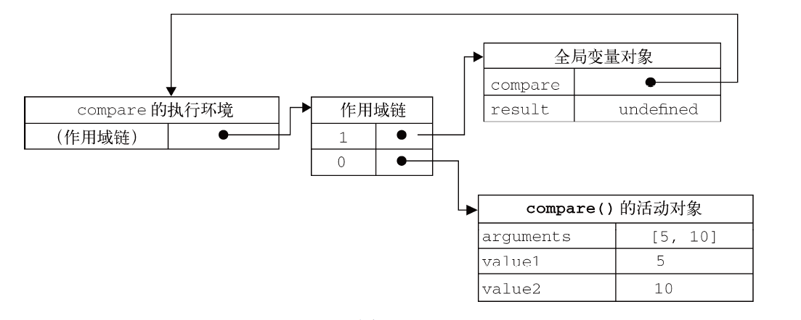

#####定义函数的方式：

######1. 函数声明

```javascript
function functionName(arg0, arg1, arg2) {
//函数体
}
```

重要特征

- **函数声明提升（function declaration hoisting）**

######2. 函数表达式

```javascript
var functionName = function(arg0, arg1, arg2){
//函数体
};
```

类似常规的变量赋值语句-创建一个函数并将它赋值给变量functionName

function 关键字后面没有标识符的函数

- 创建的函数叫做匿名函数（anonymous function）
- 匿名函数也叫拉姆达函数
- 匿名函数的name 属性是空字符串

函数表达式与其他表达式一样，在使用前必须先赋值

理解函数提升的关键，就是理解函数声明与函数表达式之间的区别：

```javascript
//不要这样做！
if(condition){
    function sayHi(){
    	alert("Hi!");
    }
} else {
    function sayHi(){
    	alert("Yo!");
    }
}

//可以这样做
var sayHi;
if(condition){
    sayHi = function(){
    	alert("Hi!");
    };
} else {
    sayHi = function(){
    	alert("Yo!");
    };
}
```

在把函数当成值来使用的情况下，都可以使用匿名函数

##### 递归

一个函数通过名字调用自己

```javascript
function factorial(num){
    if (num <= 1){
    	return 1;
    } else {
    	return num * factorial(num-1);
    }
}

var anotherFactorial = factorial;
factorial = null;
alert(anotherFactorial(4)); //出错！
```

######`arguments.callee `

- 是一个**指向正在执行的函数的指针**，
- 因此可以用它来实现对函数的递归调用(arguments.callee 代替函数名)
- 避免函数名丢而出错(比使用函数名更保险)

```javascript
function factorial(num){
    if (num <= 1){
    	return 1;
    } else {
    	return num * arguments.callee(num-1);
    }
}
```

但在严格模式下，不能通过脚本访问arguments.callee，访问这个属性会导致错误

######使用命名函数表达式来达成`argument.calle`

```javascript
var factorial = (function f(num){
    if (num <= 1){
    	return 1;
    } else {
    	return num * f(num-1);
    }
});
//创建了一个名为f()的命名函数表达式，然后将它赋值给变量factorial
```

把，命名函数赋值给了另一个变量，函数的名字f 仍然有效，所以递归调用照样能正确完成

这种方式在严格模式和非严格模式下都行得通

##### 闭包

######什么是闭包：

有权访问另一个函数作用域中的变量的函数（或对象）

```javascript
function createComparisonFunction(propertyName) {
    return function(object1, object2){
        var value1 = object1[propertyName];
        var value2 = object2[propertyName];
        //访问了外部函数中的变量propertyName
        
        if (value1 < value2){
        	return -1;
        } else if (value1 > value2){
        	return 1;
        } else {
        	return 0;
        }
    };
}
```

虽然内部函数被返回了，但是在其他地方被调用了，仍然可以访问变量propertyName

- 因为内部函数的作用域链中包含createComparisonFunction()的作用域

###### 如何理解闭包：

（如何创建作用域链以及作用）

- 当某个函数被调用时，会创建一个**执行环境（execution context）**及相应的**作用域链**
- 然后，使用arguments 和其他命名参数的值来初始化函数的**活动对象（activation object）**
- 在作用域链中，
  - 外部函数的活动对象始终处于第二位，
  - 外部函数的外部函数的活动对象处于第三位，……
  - 直至作为作用域链终点的全局执行环境

######作用域链：

```javascript
function compare(value1, value2){
    if (value1 < value2){
        return -1;
    } else if (value1 > value2){
        return 1;
    } else {
        return 0;
    }
}
var result = compare(5, 10);
```

在全局作用域中调用compare()时，

- 会创建一个包含arguments、value1 和value2 的活动对象
- 全局执行环境的变量对象（包含result和compare）在compare()执行环境的作用域链中则处于第二位



后台的每个执行环境都有一个表示变量的对象——**变量对象**

- 全局环境的变量对象始终存在，
- 而像compare()函数这样的局部环境的变量对象，则只在函数执行的过程中存在

compare()函数的执行环境而言，其作用域链中包含两个变量对象：

- 本地活动对象
- 和全局变量对象

在创建compare()函数时，

- 会创建一个预先包含全局变量对象的作用域链，这个作用域链被**保存在内部的[[Scope]]属性**中。
- 当调用compare()函数时，会为函数创建一个执行环境，
  - 然后**通过复制函数的[[Scope]]属性中的对象构建起执行环境的作用域链**。
  - 此后，又有一个活动对象（在此作为变量对象使用）被创建并被推入执行环境作用域链的前端

**作用域链本质上是一个指向变量对象的指针列表，**只引用但不实际包含变量对象

**当函数执行完毕后，局部活动对象就会被销毁，内存中仅保存全局作用域（全局执行环境的变量对象)**

- 但是，**闭包**的情况又有所不同
- **在另一个函数内部定义的函数会将包含函数（即外部函数）的活动对象添加到它的作用域链中**

在匿名函数从createComparisonFunction()中被返回后，

- 它的作用域链被初始化为包含createComparisonFunction()函数的活动对象和全局变量对象
- 匿名函数就可以访问在createComparisonFunction()中定义的所有变量
- 更为重要的是，createComparisonFunction()函数在执行完毕后，其活动对象也不会被销毁，
  - 因为匿名函数的作用域链仍然在引用这个活动对象
  - 当createComparisonFunction()函数返回后，其执行环境的作用域链会被销毁，但它的活动对象仍然会留在内存中；
  - 直到匿名函数被销毁后，createComparisonFunction()的活动对象才会被销毁

```javascript
function createComparisonFunction(propertyName) {
    return function(object1, object2){
        var value1 = object1[propertyName];
        var value2 = object2[propertyName];
        //访问了外部函数中的变量propertyName
        ...
    };
}
    
//创建函数
var compareNames = createComparisonFunction("name");
//调用函数
var result = compareNames({ name: "Nicholas" }, { name: "Greg" });
//解除对匿名函数的引用（以便释放内存）
compareNames = null;
```


> 由于闭包会携带包含它的函数的作用域，因此会比其他函数占用更多的内存。
>
> 过度使用闭包可能会导致内存占用过多，建议只在绝对必要时再考虑使用闭包

###### 闭包和变量

作用域链的这种配置机制引出了一个值得注意的副作用，

- 即闭包只能取得包含函数中任何变量的最后一个值

闭包所保存的是整个变量对象，而不是某个特殊的变量

```javascript
function createFunctions(){
    var result = new Array();
    for (var i=0; i < 10; i++){
        result[i] = function(){
        	return i;
        };
    }
    return result;
}
```

- 因为每个函数的作用域链中都保存着createFunctions() 函数的活动对象， 
  - 所以它们引用的都是同一个变量i 
- 当createFunctions()函数返回后，变量i 的值是10，
  - 此时每个函数都引用着保存变量i 的同一个变量对象，
  - 所以在每个函数内部i 的值都是10

可以通过创建另一个匿名函数强制让闭包的行为符合预期:

```javascript
function createFunctions(){
    var result = new Array();
    for (var i=0; i < 10; i++){
        result[i] = function(num){
            return function(){
            	return num;
            };
        }(i);
    }
    return result;
}
```

- 由于函数参数是按值传递的，所以就会将变量i 的当前值复制给参数num
- 而在这个匿名函数内部，又创建并返回了一个访问num 的闭包

###### 关于this对象

this 对象是在运行时基于函数的执行环境绑定的：

- 在全局函数中，this 等于window，
- 而当函数被作为某个对象的方法调用时，this 等于那个对象

**匿名函数的执行环境具有全局性，因此其this 对象通常指向window**：

```javascript
var name = "The Window";
var object = {
    name : "My Object",
    getNameFunc : function(){
        return function(){
            return this.name;
        };
    }
};
alert(object.getNameFunc()()); //"The Window"（在非严格模式下）
```

为什么匿名函数没有取得其包含作用域（或外部作用域）的this 对象呢？

- 每个函数在被调用时都会自动取得两个特殊变量：this 和arguments
- 内部函数在搜索这两个变量时，只会搜索到其活动对象为止，因此永远不可能直接访问外部函数中的这两个变
  量

把外部作用域中的this 对象保存在一个闭包能够访问到的变量里，就可以让闭包访问该对象了

```javascript
var name = "The Window";
var object = {
    name : "My Object",
    getNameFunc : function(){
        var that = this;
        return function(){
            return that.name;//即使在函数返回之后，that 也仍然引用着object
        };
    }
};
alert(object.getNameFunc()()); //"My Object"
```

在几种特殊情况下，this 的值可能会意外地改变:

```javascript
var name = "The Window";
var object = {
    name : "My Object",
    getName: function(){
    	return this.name;
    }
};

object.getName(); //"My Object"
(object.getName)(); //"My Object"
(object.getName = object.getName)(); //"The Window"，在非严格模式下,个赋值表达式的值是函数本身，所以this 的值不能得到维持，
```

###### 内存泄漏

如果闭包的作用域链中保存着一个HTML 元素，那么就意味着该元素将无法被销毁

```javascript
function assignHandler(){
    var element = document.getElementById("someElement");
    var id = element.id;//，通过把element.id 的一个副本保存在一个变量中，并且在闭包中引用该变量消除了循环引用
    element.onclick = function(){
    	alert(id);
    };
    element = null;
}
```

- 闭包会引用包含函数的整个活动对象，而其中包含着element
- 即使闭包不直接引用element，包含函数的活动对象中也仍然会保存一个引用
  - 因此，有必要把element 变量设置为null
  - 这样就能够解除对DOM 对象的引用，顺利地减少其引用数，确保正常回收其占用的内存

##### 模仿块级作用域

######JavaScript 没有块级作用域

```javascript
function outputNumbers(count){
    for (var i=0; i < count; i++){
    	alert(i);
    }
    var i; //重新声明变量
    alert(i); //计数
}
```

- JavaScript 从来不会告诉你是否多次声明了同一个变量
- 只会对后续的声明视而不见（不过，它会执行后续声明中的变量初始化)

**匿名函数可以用来模仿块级作用域**（私有作用域）:

```javascript
(function(){
	//这里是块级作用域
})();
```

```javascript
var someFunction = function(){
	//这里是块级作用域
};
someFunction();

function(){
	//这里是块级作用域
}(); //出错！
//将function 关键字当作一个函数声明的开始，而函数声明后面不能跟圆括号
//函数表达式的后面可以跟圆括号

//将函数声明转换成函数表达式
(function(){
	//这里是块级作用域
})();
```

###### 私有作用域

需要临时变量就可以使用私有作用域

```javascript
function outputNumbers(count){
    (function () {
        for (var i=0; i < count; i++){
        alert(i);
    }
    })();
    
	alert(i); //导致一个错误！
}
```

- 这种技术在全局作用域中被用在函数外部，
  - 从而限制向全局作用域中添加过多的变量和函数
  - 在一个由很多开发人员共同参与的大型应用程序中，过多的全局变量和函数很容易导致命名冲突。
  - 而通过创建私有作用域，每个开发人员既可以使用自己的变量，又不必担心搞乱全局作用域

```javascript
(function(){
    var now = new Date();
    if (now.getMonth() == 0 && now.getDate() == 1){
    	alert("Happy new year!");
    }
})();
```

- 这种做法可以减少闭包占用的内存问题，
  - 因为没有指向匿名函数的引用
  - 只要函数执行完毕，就可以立即销毁其作用域链了

###### 私有变量

任何在函数中定义的变量，都可以认为是私有变量，(因为不能在函数的外部访问这些变量)

- 包括函数的参数、

- 局部变量

- 和在函数内部定义的其他函数


**如果在这个函数内部创建一个闭包，那么闭包通过自己的作用域链也可以访问这些变量**。

而利用这一点，就可以创建用于访问私有变量的公有方法

把有权访问私有变量和私有函数的公有方法称为**特权方法（privileged method）**


有两种在对象上创建特权方法的方式:

第一种：在构造函数中定义特权方法

```javascript
function MyObject(){
    //私有变量和私有函数
    var privateVariable = 10;
    function privateFunction(){
    	return false;
    }
    //特权方法
    this.publicMethod = function (){
        privateVariable++;
        return privateFunction();
    };
}
```

- 能够在构造函数中定义特权方法，是因为特权方法作为闭包有权访问在构造函数中定义的所有变量和函数

- 变量privateVariable 和函数privateFunction()只能通过特权方法publicMethod()来访问
- 在创建MyObject 的实例后，除了使用publicMethod()这一个途径外，没有任何办法可以直接访问privateVariable 和privateFunction()

第二种：通过在私有作用域中定义私有变量或函数，也可以创建特权方法

```javascript
(function(){
    //私有变量和私有函数
    var privateVariable = 10;
    function privateFunction(){
    	return false;
    }
    //构造函数
    MyObject = function(){
    };
    //公有/特权方法
    MyObject.prototype.publicMethod = function(){
        privateVariable++;
        return privateFunction();
    };
})();
```

需要注意的是

- 这个模式在**定义构造函数时并没有使用函数声明，而是使用了函数表达式**
- 函数声明只能创建局部函数，(并不是我们想要的)
- 出于同样的原因，我们也**没有在声明MyObject 时使用var 关键字**
  - 记住：初始化未经声明的变量，总是会创建一个全局变量
- 因此，**MyObject 就成了**一个**全局变量**，能够在私有作用域之外被访问到
- (在严格模式下给未经声明的变量赋值会导致错误)

**主要区别**:(和构造函数定义特权方法)

- 就在于**私有变量和函数是由实例共享的**
- 由于特权方法是在原型上定义的，因此所有实例都使用同一个函数
- 而这个特权方法，作为一个闭包，总是保存着对包含作用域的引用

利用私有和特权成员，可以隐藏那些不应该被直接修改的数据：

```javascript
function Person(name){
    this.getName = function(){
    	return name;
    };
    this.setName = function (value) {
    	name = value;
    };
}
var person = new Person("Nicholas");
alert(person.getName()); //"Nicholas"
person.setName("Greg");
alert(person.getName()); //"Greg"
```

构造函数模式的缺点是针对每个实例都会创建同样一组新方法，而使用静态私有变量来实现特权方法就可以避免这个问题

###### 静态私有变量

```javascript
(function(){
    var name = "";
    Person = function(value){
    	name = value;
    };
    Person.prototype.getName = function(){
    	return name;
    };
    Person.prototype.setName = function (value){
        name = value;
    };
})();
var person1 = new Person("Nicholas");
alert(person1.getName()); //"Nicholas"
person1.setName("Greg");
alert(person1.getName()); //"Greg"
var person2 = new Person("Michael");
alert(person1.getName()); //"Michael"
alert(person2.getName()); //"Michael"
```

- Person 构造函数与getName()和setName()方法一样，都有权访问私有变量name
- 在这种模式下，变量name 就变成了一个静态的、**由所有实例共享的属性**
  - 在一个实例上调用setName()会影响所有实例
  - 而调用setName()或新建一个Person 实例都会赋予name 属性一个
    新值
  - 结果就是所有实例都会返回相同的值

> 多查找作用域链中的一个层次，就会在一定程度上影响查找速度
>
> 而这正是使用闭包和私有变量的一个显明的不足之处

###### 模块模式

为单例单例创建私有变量和特权方法

单例（singleton）：

- 只有一个实例对象

JavaScript 是以对象字面量的方式来创建单例对象：

```javascript
var singleton = {
    name : value,
    method : function () {
    	//这里是方法的代码
    }
};
```

模块模式通过为单例添加私有变量和特权方法使其增强：

```javascript
var singleton = function(){
    //私有变量和私有函数
    var privateVariable = 10;
    function privateFunction(){
    	return false;
    }
    //特权/公有方法和属性
    return {
        publicProperty: true,
        publicMethod : function(){
            privateVariable++;
            return privateFunction();
        }
    };
}();
```

- 这个模块模式使用了一个返回对象的匿名函数
- 在这个匿名函数内部，
  - 首先定义了私有变量和函数
  - 然后，将一个对象字面量作为函数的值返回
  - 返回的对象字面量中只包含可以公开的属性和方法
- 由于这个对象是在匿名函数内部定义的，因此它的公有方法有权访问私有变量和函数。
- 从本质上来讲，这个对象字面量定义的是单例的公共接口

模块模式在需要对单例进行某些初始化，同时又需要维护其私有变量时是非常有用：

```javascript
var application = function(){
    //私有变量和函数
    var components = new Array();
    //初始化
    components.push(new BaseComponent());
    //公共
    return {
    	getComponentCount : function(){
        	return components.length;
        },
        registerComponent : function(component){
            if (typeof component == "object"){
            	components.push(component);
            }
        }
    };
}();
```

在创建application对象(用于管理组件-单例管理应用程序的级的信息）的过程中，

- 首先声明了一个私有的components数组，并向数组中添加了一个BaseComponent 的新实例
- 而返回对象的getComponentCount()和registerComponent()方法，都是有权访问数组components 的特权方法
  - 前者只是返回已注册的组件数目，
  - 后者用于注册新组件

> 如果必须创建一个对象并以某些数据对其进行初始化，同时还要公开一些能够访问这些私有数据的方法，那么就可以使用模块模式
>
> 以这种模式创建的每个单例都是Object 的实例，因为最终要通过一个对象字面量来表示它

###### 增强的模块模式

即在返回对象之前加入对其增强的代码——适合那些单例必须是某种类型的实例，同时还必须添加某些属性和（或）方法对其加以增强的情况

```javascript
var singleton = function(){
    //私有变量和私有函数
    var privateVariable = 10;
    function privateFunction(){
    	return false;
    }
    //创建对象
    var object = new CustomType();
    //添加特权/公有属性和方法
    object.publicProperty = true;
    object.publicMethod = function(){
        privateVariable++;
        return privateFunction();
    };
    //返回这个对象
    return object;
}();
```

模块模式的例子中的application 对象必须是BaseComponent 的实例，那么就可以:

```javascript
var application = function(){
    //私有变量和函数
    var components = new Array();
    //初始化
    components.push(new BaseComponent());
    //创建application 的一个局部副本
    var app = new BaseComponent();
    //公共接口
    app.getComponentCount = function(){
        return components.length;
    };
    app.registerComponent = function(component){
        if (typeof component == "object"){
            components.push(component);
        }
    };
    //返回这个副本
    return app;
}();
```

主要的区别：

- 命名变量app 的创建过程，因为它必须是BaseComponent 的实例